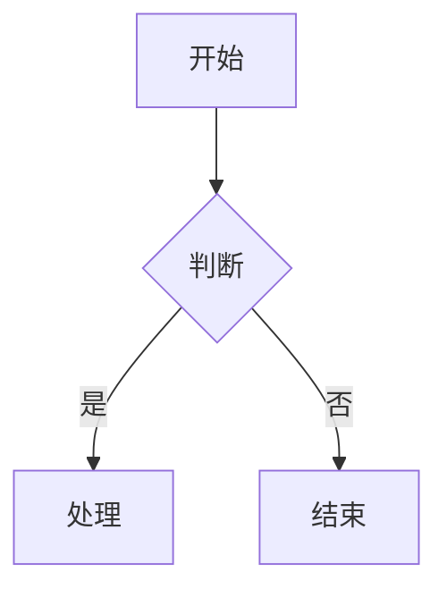

# Markdown Editor and Converter

一个支持实时预览和导出功能的Markdown编辑器，能够处理LaTeX数学公式和Mermaid图表。

## 特性

- 实时预览Markdown内容
- 支持LaTeX数学公式（行内和块级）
- 支持Mermaid、Sequence和Flowchart图表
- 代码高亮显示
- 导出为DOCX和PDF格式
- 中文友好支持

## 安装

### 前置要求

- Python 3.6+
- Pandoc
- Mermaid CLI (mmdc)
- XeLaTeX (用于PDF导出)

### 安装步骤

1. 克隆仓库

```bash
git clone https://github.com/YILING0013/markdown_2_docx.git
cd markdown_2_docx
```

2. 安装Python依赖

```bash
pip install -r requirements.txt
```

3. 安装Pandoc

- 根据您的系统，从[Pandoc官网](https://pandoc.org/installing.html)下载并安装

4. 安装Mermaid CLI

```bash
npm install -g @mermaid-js/mermaid-cli
```

5. 安装XeLaTeX (用于PDF导出)

- Windows: 安装[MiKTeX](https://miktex.org/download)
- macOS: 安装[MacTeX](https://www.tug.org/mactex/)
- Linux: 安装texlive-xetex包
  ```bash
  sudo apt-get install texlive-xetex
  ```

## 使用方法

### 启动Web应用

```bash
python app.py
```

然后在浏览器中访问 `http://localhost:5000`

### 使用命令行工具转换Markdown文件

```bash
python convert_md_to_docx.py input.md output.docx
```

## 特殊语法

### LaTeX数学公式

- 行内公式: `\( 数学公式 \)` 或 `$ 数学公式 $`
- 块级公式: `\[ 数学公式 \]` 或 `$$ 数学公式 $$`

### Mermaid图表

支持的图表类型：
- mermaid
- sequence
- flowchart

使用示例：



## 问题排查

- 如果DOCX导出失败，检查Pandoc是否正确安装
- 如果图表渲染失败，检查mermaid-cli是否安装并可用
- 如果PDF导出失败，确保XeLaTeX已安装并配置正确

## 依赖

主要Python依赖：
- Flask
- markdown
- pypandoc
- weasyprint (可选，用于PDF导出的替代方法)

外部依赖：
- Pandoc
- mermaid-cli
- XeLaTeX

完整依赖列表请参见 `requirements.txt`。
